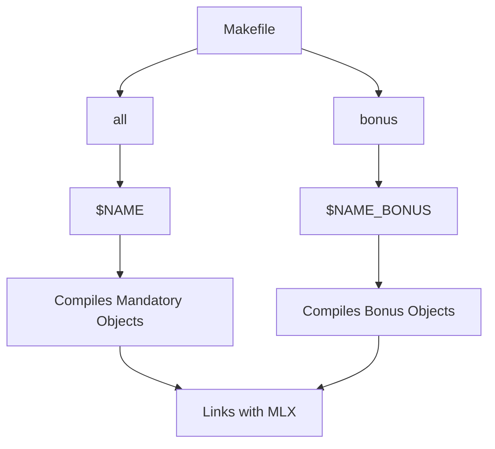
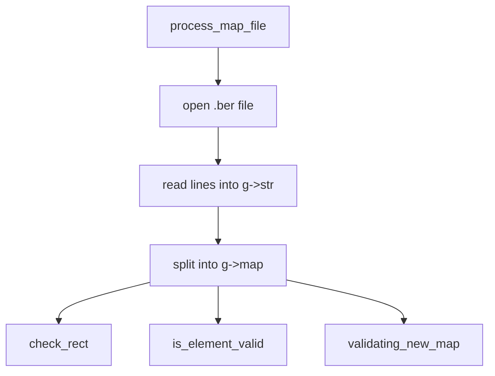
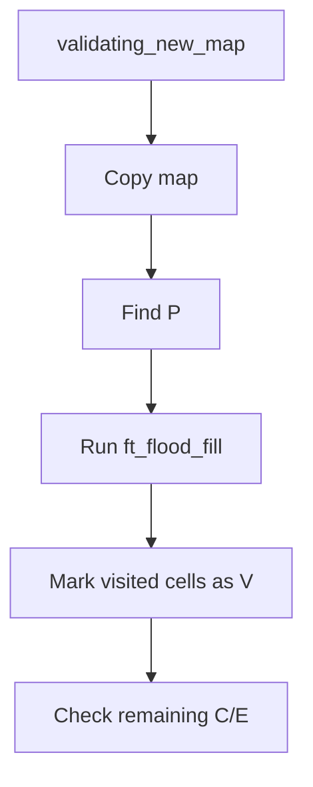
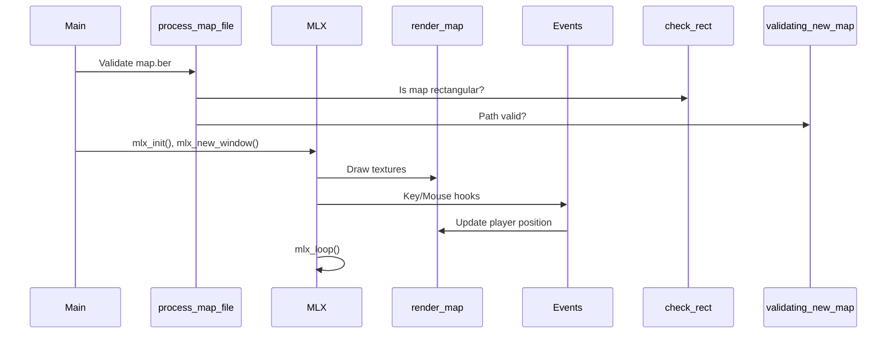
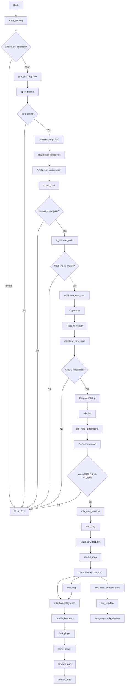

Let's break down your entire project with detailed explanations, diagrams, and function summaries.

---

### **1. Makefile Structure**
```makefile
CC = cc
CFLAGS = -Wall -Wextra -Werror 
NAME = so_long
NAME_BONUS = so_long_bonus
```
- **Purpose**: Compiles mandatory and bonus versions of the game.
- **Key Features**:
  - Compiles with strict flags (`-Wall -Wextra -Werror`).
  - Separates mandatory and bonus builds.
  - Color-coded output for clarity.
  - Handles dependencies via headers.

**Mermaid Chart**:


---

### **2. Core C Files**

#### **`so_long.c`**
- **Main Function**:
  ```c
  int main(int argc, char **argv) {
      // Initializes game, checks map, starts graphics
  }
  ```
- **Key Functions**:
  - `map_parsing()`: Validates `.ber` file and map.
  - `is_graphic_mlx()`: Initializes MLX and starts the game loop.

---

#### **`process_map_file.c`**
**Purpose**: Validates the map file (`.ber`).  
**Key Functions**:
1. `check_rect()`: Ensures the map is rectangular and surrounded by walls.
2. `is_element_valid()`: Validates characters (`P`, `E`, `C` counts).
3. `validating_new_map()`: Flood fill to verify path validity.

**Flow**:


---

#### **`draw_map.c`**
**Purpose**: Renders the map using MinilibX.  
**Key Functions**:
1. `get_map_dimensions()`: Calculates window size (tile size = 50px).
2. `load_img()`: Loads XPM textures.
3. `render_map()`: Draws textures based on map data.

---

#### **`events.c`**
**Purpose**: Handles player movement and key presses.  
**Key Functions**:
1. `find_player()`: Locates `P` in the map.
2. `move_player()`: Updates player position and game state.
3. `handle_keypress()`: Triggers actions for `WASD`/`ESC` keys.

---

#### **`ft_flood_fill.c`**
**Purpose**: Validates that all `C`/`E` are reachable.  
**Algorithm**:


---

### **3. Utility Files**

#### **`ft_split.c`**
- **Purpose**: Splits strings (used to parse the map).
- **Input**: `"111\n1P1\n111"` → **Output**: `["111", "1P1", "111"]`.

#### **`get_next_line.c`**
- **Purpose**: Reads the `.ber` file line by line.
- **Key Feature**: Buffer management for large files.

---

### **4. Key Data Structures**
```c
typedef struct s_game {
    // Map data
    char    **map;
    size_t  num_line;
    // Graphics
    void    *mlx;
    void    *win;
    void    *textures[5];
    // Game state
    size_t  player_x, player_y;
    size_t  count_c;
};
```

---

### **5. Texture File (`player.xpm`)**
- **Purpose**: XPM image for the player character.
- **Usage**: Loaded via `mlx_xpm_file_to_image()` in `load_img()`.

---

### **6. Function I/O Table**

| Function             | Input                      | Output                     | Purpose                                      |
|----------------------|---------------------------|----------------------------|---------------------------------------------|
| `process_map_file()`        | `char *pat_str`           | `int` (0/1)                | Validates map file and structure.           |
| `load_img()`         | `t_game *g`               | `void`                     | Loads XPM textures into `g->textures`.      |
| `render_map()`       | `t_game *g`               | `void`                     | Draws map using textures.                   |
| `ft_flood_fill()`       | `x, y, map`               | `void`                     | Marks reachable cells from `P`.             |
| `handle_keypress()`  | `int key, t_game *g`      | `int`                      | Moves player or exits on key press.         |
| `get_next_line()`    | `int fd`                  | `char *` (line)            | Reads lines from `.ber` file.               |

---

### **7. Mermaid: Full Program Flow**


---

### **8. Key Takeaways**
1. **Map Validation**:
   - Must be rectangular, bordered by `1`, with exactly `1P`, `1E`, and `≥1C`.
   - Use `check_rect()` and `validating_new_map()`.

2. **Rendering**:
   - Tile size = 50px → Window size = `cols*50 x rows*50`.
   - Textures are loaded once and reused.

3. **Movement**:
   - `WASD` keys update `player_x`/`player_y`.
   - `render_map()` redraws the entire map after movement.

4. **Memory Safety**:
   - `free_map()` ensures no leaks.
   - `exit_window()` cleans up MLX resources.

---

### **9. Potential Issues & Fixes**
1. **Map Validation Failures**:
   - Ensure `.ber` has no trailing newlines.
   - Use `valgrind` to check leaks in `ft_split()`.

2. **Texture Loading**:
   - Verify XPM paths (e.g., `"./textures/wall.xpm"`).

3. **Window Size**:
   - If map is too large (>2550x1400), resize textures or reject the map.

---

Let me know if you'd like to dive deeper into any component!

----

Here’s a **detailed Mermaid chart** for your `so_long` project, strictly following syntax rules and avoiding unsupported characters:



---

### **Key Explanations**:
1. **Start**: `main` calls `map_parsing` to verify `.ber` file.
2. **Map Validation**:
   - `check_rect`: Checks map is rectangular and walls.
   - `is_element_valid`: Validates `P`, `E`, `C` counts.
   - `validating_new_map`: Uses flood fill to ensure path validity.
3. **Graphics**:
   - `mlx_init` → `mlx_new_window` → `load_img` (textures).
   - `render_map`: Draws tiles at `(col*50, row*50)`.
4. **Event Loop**:
   - `mlx_hook` captures keypresses and window close events.
   - `handle_keypress` → `move_player` updates game state.
5. **Cleanup**:
   - `exit_window` frees memory and destroys MLX window.

---

### **Rules Followed**:
1. No parentheses `()` in node labels.
2. Arrows (`-->`) only for direction.
3. Conditionals use `{ }` and `| |`.
4. Simplified function names (e.g., `checking_new_map` → `checking_new_map`).

Let me know if you need adjustments!
