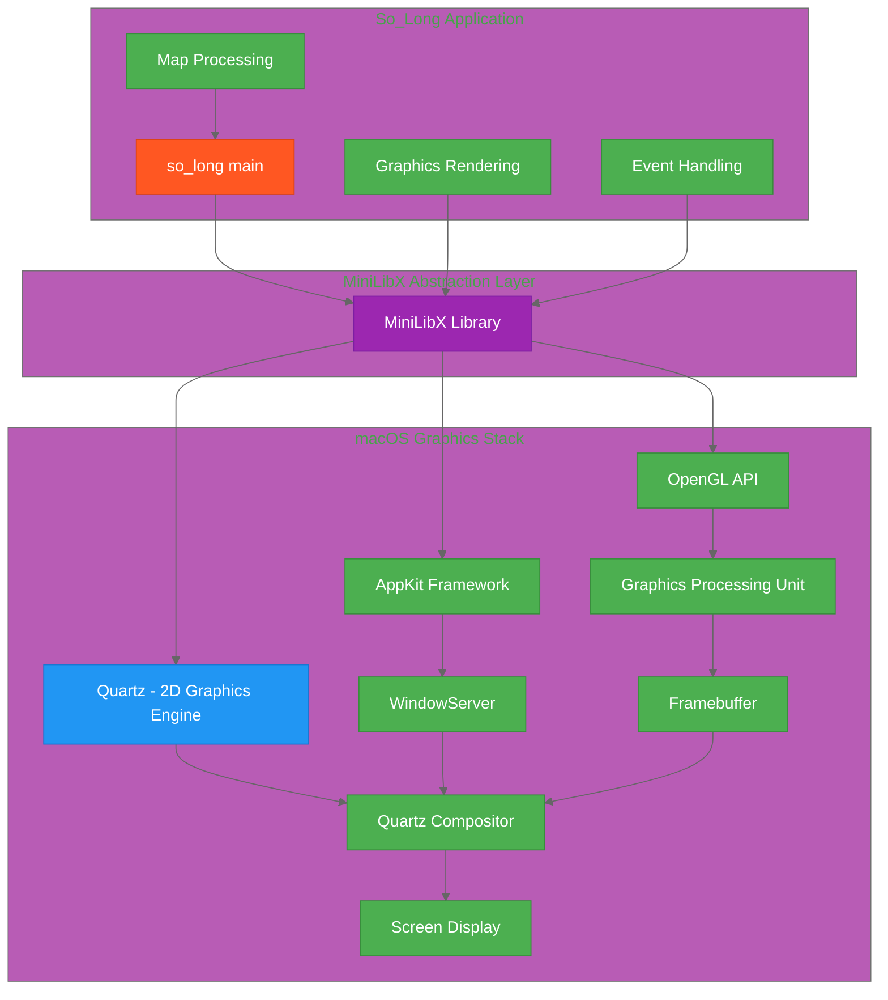
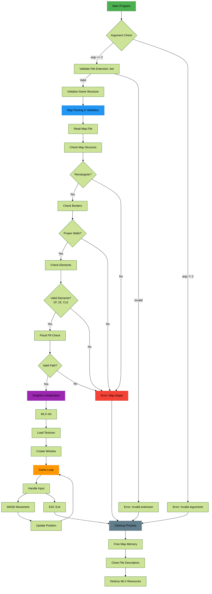
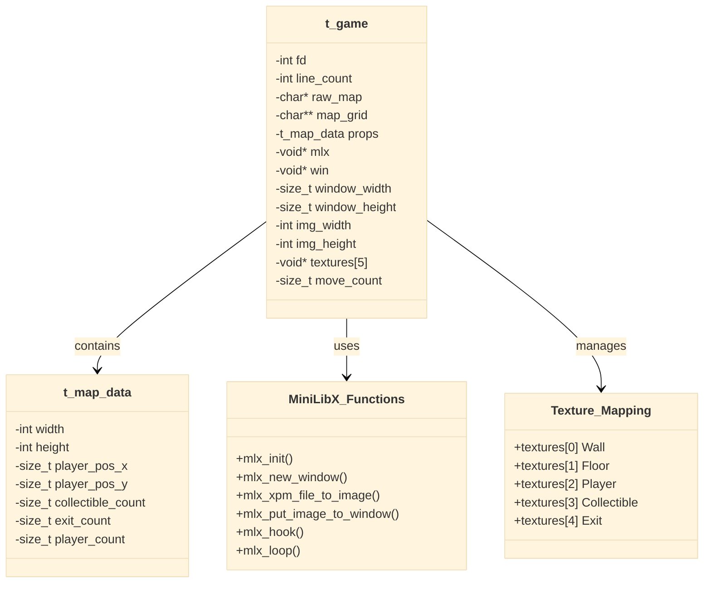
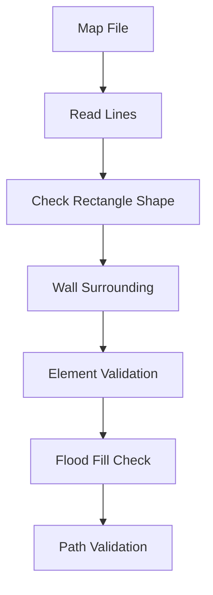
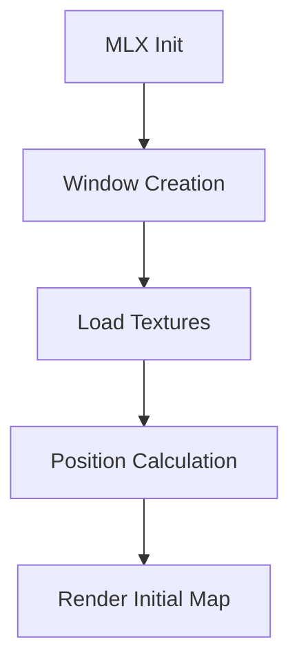
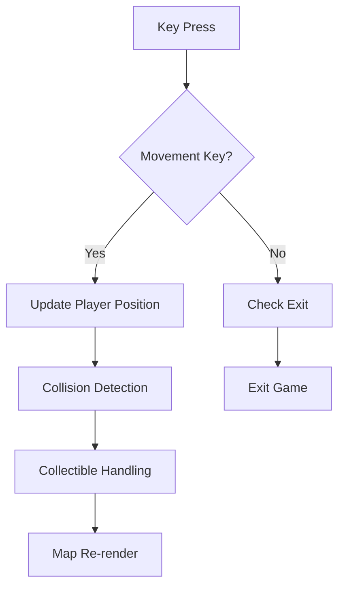
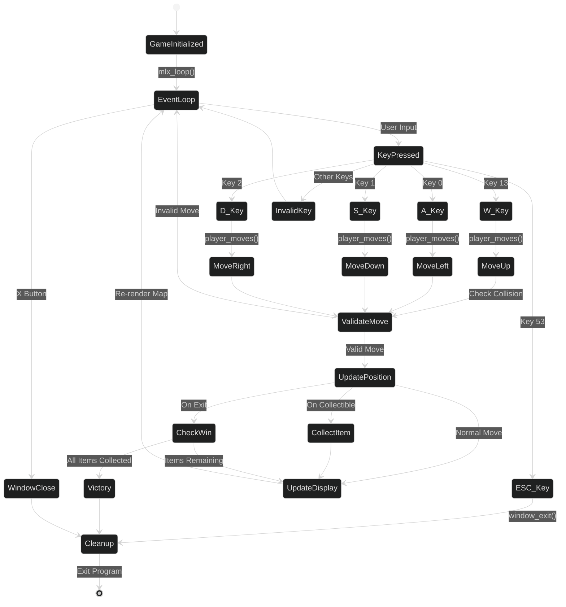
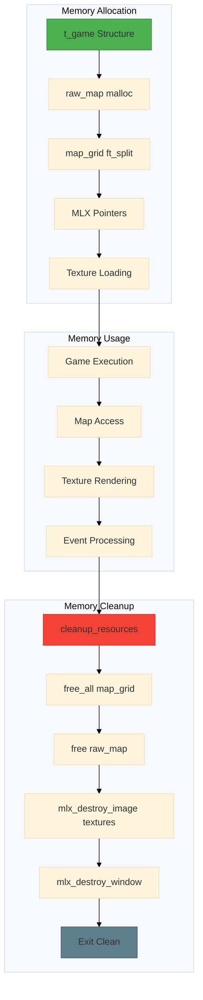
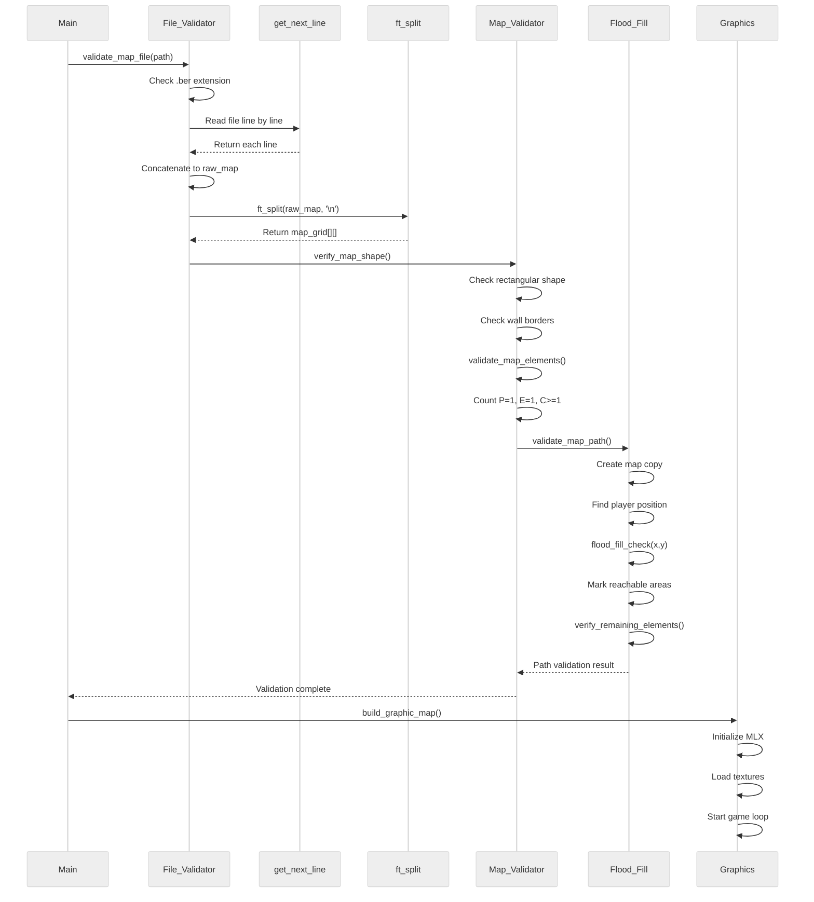

```mermaid
%%{init: {'theme': 'base'}}%%
flowchart TD
    subgraph "Input Validation Errors"
        E1[Invalid Arguments] --> ERR[Error Handler]
        E2[Wrong File Extension] --> ERR
        E3[File Not Found] --> ERR
    end
    
    subgraph "Map Validation Errors"  
        E4[Non-rectangular Map] --> ERR
        E5[Missing Wall Border] --> ERR
        E6[Invalid Element Count] --> ERR
        E7[Unreachable Elements] --> ERR
        E8[Map Too Large] --> ERR
    end
    
    subgraph "System Errors"
        E9[MLX Init Failed] --> ERR
        E10[Window Creation Failed] --> ERR
        E11[Texture Load Failed] --> ERR
        E12[Memory Allocation Failed] --> ERR
    end
    
    ERR --> CLEAN[cleanup_resources]
    CLEAN --> FREE[Free All Memory]
    FREE --> EXIT[Exit with Error Code]
    
    style ERR fill:#F44336,stroke:#D32F2F
    style CLEAN fill:#607D8B,stroke:#455A64
    style EXIT fill:#424242,stroke:#212121
```

# So_Long: Complete 2D Game Development Guide
## Minimalist Pixel Art Game with MiniLibX


## 📺 Gameplay Demo

### Video Showcase
[](https://vimeo.com/1065327226)
[Watch the video on Vimeo](https://player.vimeo.com/video/1065327226)

### Live Gameplay


---

## 🎯 Project Overview

So_Long is a minimalist 2D pixel art game developed as part of the 42 curriculum using MiniLibX. Players navigate through creative maps, collect items, and reach the exit in this retro-inspired adventure.

### Core Features
- **Minimalist Pixel Art**: Simple yet vibrant design evoking retro gaming nostalgia
- **Smooth Gameplay**: Intuitive movement and collision detection
- **Creative Levels**: Unique map layouts that challenge the player
- **42 Standards**: Developed following 42 school project guidelines

---

## 🏗️ System Architecture

### macOS Graphics Stack Integration



---

## 🔧 Core Technologies Deep Dive

### 1. macOS Graphics System Components

#### A. Quartz: The Foundation
- **Core 2D Graphics Engine**: Handles pixels, shapes, text, and images
- **Transparency & Effects**: Supports gradients, transparency, and visual effects
- **Quartz Compositor**: Combines visual elements from various sources into final display
- **Low-Level Nature**: Developers typically don't interact directly due to complexity

#### B. AppKit: macOS GUI Framework
- **macOS-Specific**: Part of the Cocoa framework, unique to macOS
- **Key Components**:
  - **Windows & Views**: NSWindow (application windows), NSView (rendering/events)
  - **Event Handling**: Mouse clicks, key presses, gestures
  - **Drawing & Graphics**: NSGraphicsContext, NSBezierPath, NSImage
  - **UI Controls**: NSButton, NSSlider, NSTableView
  - **Document Management**: NSDocument structure
  - **Menus & Toolbars**: NSMenu, NSToolbar classes
  - **Animations**: NSAnimation for basic effects
  - **Accessibility**: Built-in compliance
  - **Drag & Drop**: Native support
  - **File Integration**: File system interaction

#### C. OpenGL: Hardware-Accelerated Graphics
- **Cross-Platform API**: Works across different operating systems
- **GPU Acceleration**: Leverages graphics hardware for performance
- **2D & 3D Capabilities**: Comprehensive graphics rendering
- **Why Use with MiniLibX**:
  - **Performance**: AppKit drawing isn't optimized for high-performance graphics
  - **Advanced Features**: 3D rendering, shaders, lighting, shadows, textures
  - **Real-Time Rendering**: Suitable for animations and interactive graphics

#### D. WindowServer: Window Management
- **System Process**: Manages windowing, graphical output, user interaction
- **Key Functions**:
  - Window layout and visibility management
  - Intermediary between applications and graphics hardware
  - Input event routing (clicks, keystrokes)
  - Resource allocation for windows

#### E. GPU: Graphics Processing Unit
- **Specialized Hardware**: Designed for graphics acceleration
- **Core Responsibilities**:
  - Rendering graphics (shapes, textures, 3D objects)
  - Parallel calculations for rendering and shaders
  - Memory management (textures, frame buffers)
- **OpenGL Integration**: Direct communication for efficient rendering

### 2. MiniLibX: Simplified Graphics Library

#### Purpose & Design
- **Educational Focus**: Designed for 42 School projects
- **Abstraction Layer**: Hides complexity of Quartz, AppKit, and OpenGL
- **Simple Interface**: Easy-to-use functions for graphics programming

#### MiniLibX Workflow on macOS

##### Starting the Program (`mlx_init()`)
**Internal Actions:**
- Initializes internal data structures for windows, events, rendering
- Sets up OpenGL context (GPU workspace)
- Establishes AppKit communication
- Reserves WindowServer resources

**Connection Flow:**
1. MiniLibX → AppKit connection request
2. AppKit → WindowServer resource reservation
3. OpenGL context preparation

**Return Value**: MiniLibX instance pointer (success) or NULL (failure)

##### Creating Windows (`mlx_new_window()`)
**Process:**
1. MiniLibX forwards request to AppKit (size, title)
2. AppKit communicates with WindowServer
3. WindowServer allocates resources, makes window visible
4. Quartz Compositor handles layering and display

##### Graphics Rendering (`mlx_pixel_put()` example)
**Rendering Pipeline:**
1. MiniLibX converts to OpenGL instructions
2. OpenGL sends commands to GPU
3. GPU writes to framebuffer
4. Quartz Compositor reads framebuffer
5. Final composition and display

##### Event Handling (`mlx_key_hook()`, `mlx_loop()`)
**Event Flow:**
1. `mlx_key_hook()` sets callback function
2. `mlx_loop()` starts event listening
3. WindowServer detects input → AppKit → MiniLibX
4. Callback function execution

---

## 🎮 Program Flow Architecture



---

## 🗂️ Data Structure Design



---

## 📋 Complete Implementation Details

### Key MiniLibX Functions

#### Initialization Functions
- **`mlx_init()`**: Establishes connection with graphical server
  - Returns: MiniLibX instance pointer or NULL on failure
  - Sets up OpenGL context and AppKit communication

#### Window Management
- **`mlx_new_window(mlx_ptr, width, height, title)`**: Creates new window
  - Returns: Window pointer or NULL on failure
- **`mlx_clear_window(mlx_ptr, win_ptr)`**: Clears window content
- **`mlx_destroy_window(mlx_ptr, win_ptr)`**: Closes and frees window resources

#### Drawing Functions
- **`mlx_pixel_put(mlx_ptr, win_ptr, x, y, color)`**: Draws single pixel
  - Color format: 0xRRGGBB or 0xAARRGGBB
  - Performance: Slow for many pixels, use images instead

#### Image Management
- **`mlx_xpm_file_to_image(mlx_ptr, filename, &width, &height)`**: Loads XPM image
- **`mlx_put_image_to_window(mlx_ptr, win_ptr, img_ptr, x, y)`**: Displays image
- **`mlx_new_image(mlx_ptr, width, height)`**: Creates blank image
- **`mlx_get_data_addr(img_ptr, &bits_per_pixel, &size_line, &endian)`**: Raw pixel access
- **`mlx_destroy_image(mlx_ptr, img_ptr)`**: Frees image resources

#### Event Handling
- **`mlx_loop(mlx_ptr)`**: Starts event loop (blocking)
- **`mlx_hook(win_ptr, event, mask, function_ptr, param)`**: Sets event callback
- **`mlx_key_hook(win_ptr, function_ptr, param)`**: Key press callback
- **`mlx_mouse_hook(win_ptr, function_ptr, param)`**: Mouse button callback
- **`mlx_loop_hook(mlx_ptr, function_ptr, param)`**: Loop iteration callback

#### Text Display
- **`mlx_string_put(mlx_ptr, win_ptr, x, y, color, string)`**: Displays text

---

## 🎯 Map Validation System

### Validation Components



### Validation Rules
1. **File Extension**: Must be `.ber`
2. **Shape**: Rectangular map only
3. **Borders**: Surrounded by walls (`1`)
4. **Elements**: Exactly 1 Player (`P`), 1 Exit (`E`), at least 1 Collectible (`C`)
5. **Path**: All collectibles and exit must be reachable from player position

### Flood Fill Algorithm
**Purpose**: Verify all required elements are accessible from player starting position

**Process**:
1. Create copy of map
2. Find player starting position
3. Recursively mark all reachable floor tiles
4. Verify all collectibles and exit are marked as reachable

---

## 🎨 Graphics System

### Graphics Initialization Flow



### Texture Management
- **Tile Size**: 50x50 pixels per game tile
- **Texture Array**:
  - `textures[0]`: Wall texture
  - `textures[1]`: Floor texture
  - `textures[2]`: Player texture
  - `textures[3]`: Collectible texture
  - `textures[4]`: Exit texture

### Window Size Calculation
- **Formula**: `window_width = map_width * 50`, `window_height = map_height * 50`
- **Limit**: Maximum 2550x1400 pixels (51x28 tiles)

---

## 🎮 Game Loop Mechanics



### Input Handling
**Key Mappings** (macOS):
- **ESC**: `53` - Exit game
- **W**: `13` - Move up
- **A**: `0` - Move left
- **S**: `1` - Move down
- **D**: `2` - Move right

### Movement Logic
1. **Input Detection**: Key press triggers callback
2. **Position Calculation**: Determine target position
3. **Collision Check**: Verify move is valid (not into wall)
4. **State Update**: Update player position, collect items
5. **Display Update**: Re-render map with new positions
6. **Win Condition**: Check if all collectibles gathered and exit reached

---

## 🔄 Event System Architecture



---

## 🧠 Memory Management

### Memory Allocation Flow



### Cleanup Process
**Critical**: Always destroy resources before program exit
1. **Free Map Memory**: `free_all()` for map_grid, `free()` for raw_map
2. **Destroy Images**: `mlx_destroy_image()` for all textures
3. **Close Window**: `mlx_destroy_window()`
4. **Close Files**: Close any open file descriptors

---

## ⚠️ Error Handling System



### Error Categories
**Input Validation Errors**:
- Invalid arguments (not exactly 2)
- Wrong file extension (not `.ber`)
- File not found or unreadable

**Map Validation Errors**:
- Non-rectangular shape
- Missing wall borders
- Invalid element counts
- Unreachable elements
- Map too large for display

**System Errors**:
- MiniLibX initialization failure
- Window creation failure
- Texture loading failure
- Memory allocation failure

---

## 🔧 File Processing Pipeline



---

## 🏗️ Project Structure

```
so_long/
├── Makefile                 # Build system
├── so_long.h               # Header with all definitions
├── so_long.c               # Main program entry
├── process_map_file.c      # Map validation logic
├── draw_map.c              # Graphics and rendering
├── events.c                # Input handling
├── ft_flood_fill.c         # Path validation algorithm
├── get_next_line.c         # File reading utility
├── ft_split.c              # String manipulation
├── textures/               # XPM image files
│   ├── wall.xpm
│   ├── floor.xpm  
│   ├── player.xpm
│   ├── collectible.xpm
│   └── exit.xpm
└── maps/                   # Test map files
    └── *.ber
```

---

## 📊 Key Constants & Definitions

```c
// Buffer and key definitions
#define BUFFER_SIZE 10        // get_next_line buffer
#define ESC_KEY 53           // Escape key code
#define W_KEY 13             // W key movement
#define S_KEY 1              // S key movement  
#define A_KEY 0              // A key movement
#define D_KEY 2              // D key movement
#define ON_DESTROY 17        // Window destroy event
#define TILE_SIZE 50         // Each tile is 50x50 pixels

// Color format examples
#define COLOR_RED 0xFF0000    // Red color
#define COLOR_GREEN 0x00FF00  // Green color
#define COLOR_BLUE 0x0000FF   // Blue color
```

---

## 🎯 Development Best Practices

### Code Organization
1. **Modular Design**: Separate concerns (map validation, graphics, events)
2. **Error Handling**: Comprehensive error checking at every step
3. **Memory Management**: Always pair allocation with deallocation
4. **Resource Cleanup**: Destroy all MiniLibX resources before exit

### Performance Considerations
1. **Image vs Pixel**: Use images for complex graphics, pixel_put for simple elements
2. **Efficient Rendering**: Only re-render when necessary
3. **Memory Usage**: Free unused resources promptly

### 42 School Standards
1. **Norm Compliance**: Follow 42 coding standards
2. **Function Limits**: Keep functions under 25 lines
3. **File Organization**: Logical separation of functionality
4. **Error Messages**: Clear, informative error reporting

---

## 🚀 Getting Started

### Prerequisites
- macOS with MiniLibX installed
- GCC compiler
- Make build system

### Compilation
```bash
make
```

### Usage
```bash
./so_long maps/map.ber
```

### Controls
- **WASD**: Move player
- **ESC**: Exit game
- **Objective**: Collect all items and reach the exit

---

## Author;

🎓 42 Intra: [ymazini](https://profile.intra.42.fr/users/ymazini)
🐙 GitHub: [yomazini](https://github.com/yomazini)
💼 LinkedIn: [Connect with me](https://www.linkedin.com/in/youssef-mazini/)


