# So_Long Minimalist 2D Pixel Art Gameplay

Experience the retro charm of So_Long – a minimalist 2D pixel art game built using MiniLibX as part of the 42 curriculum. Navigate creative maps, collect items, and reach the exit in this retro-inspired adventure!

## Gameplay Video
## About So_Long

So_Long is a minimalist 2D pixel art game developed to meet the requirements of the 42 curriculum. In the game, the player navigates through uniquely designed maps, collects in-game items, and finds the exit to win the game.

### Features

- **Minimalist Pixel Art:** Simple yet vibrant design that evokes retro gaming nostalgia.
- **Smooth Gameplay:** Intuitive movement and collision detection.
- **Creative Levels:** Unique map layouts that challenge the player.
- **42 Standards:** Developed following the guidelines and style of the 42 school projects.

[Watch the video on Vimeo](https://player.vimeo.com/video/1065327226))
[](https://vimeo.com/1065327226)
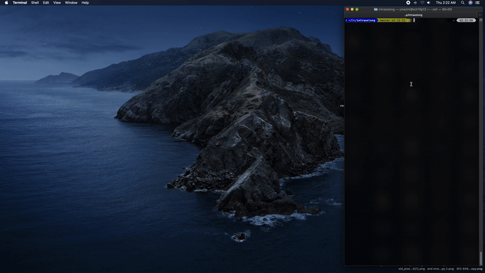


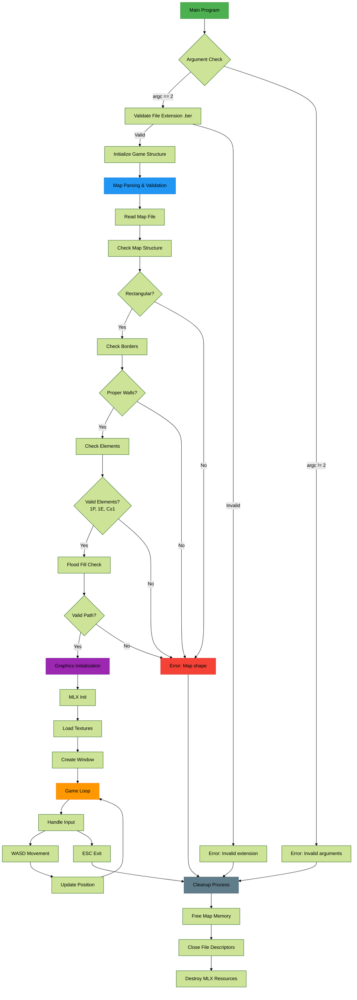

Key Components Explained:

1. **Map Validation Flow**
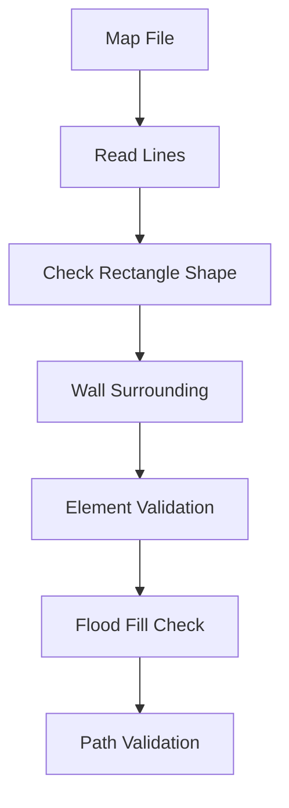

2. **Graphics Initialization**
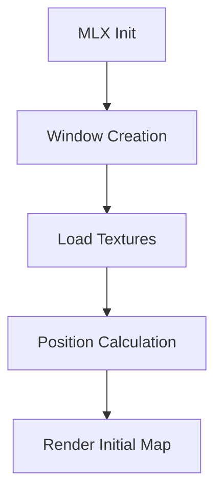

3. **Game Loop Mechanics**
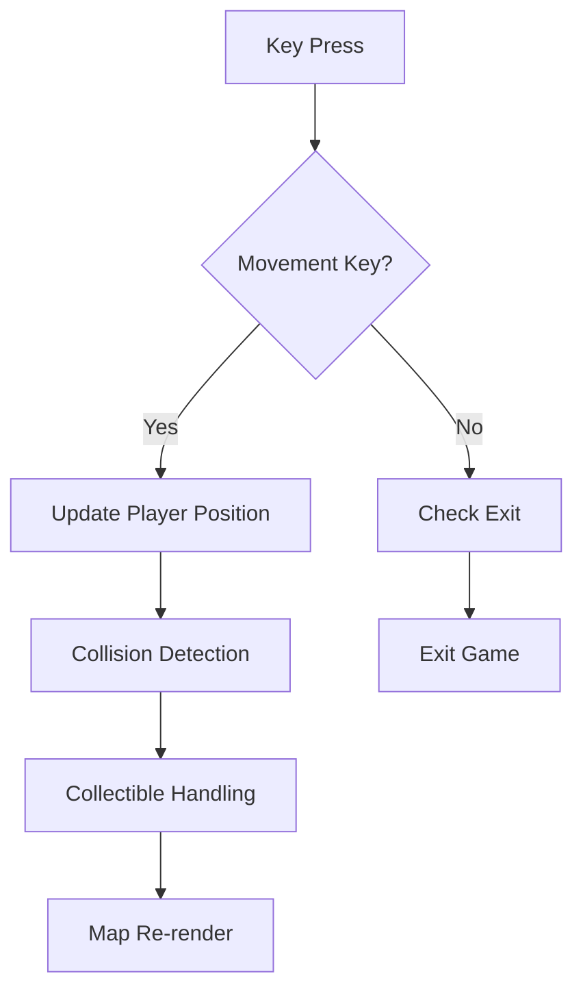

4. **Error Handling Cases**
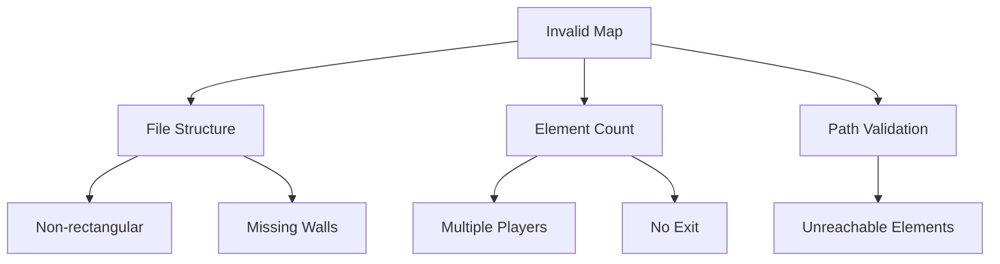

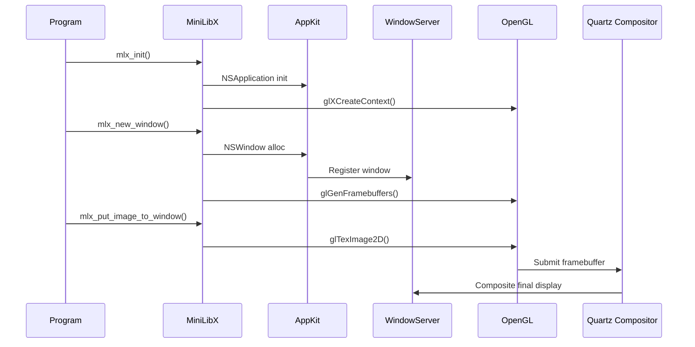
    
-------------------


------------------

------------------

I. Core macOS Graphics Components

A. AppKit:

    Definition: macOS-specific framework within the Cocoa framework used for building graphical user interfaces (GUIs) for macOS applications. It's the "backbone of most macOS applications."
    Key Features:Windows and Views:NSWindow: Manages application windows.
    NSView: Fundamental building block for rendering and event handling.

    Event Handling: Manages user interactions (mouse, keyboard, gestures).
    Drawing and Graphics: Supports 2D graphics (NSGraphicsContext, NSBezierPath, NSImage).
    Controls and Interface Components: Includes buttons (NSButton), sliders (NSSlider), tables (NSTableView), etc.
    Document Management: Structure for document-based apps (NSDocument).
    Menus and Toolbars: Classes for creating and managing (NSMenu, NSToolbar).
    Animation and Effects: Basic animations (NSAnimation).
    Accessibility: Compliance through Accessibility APIs.
    Drag and Drop: Built-in support.
    File Handling: Integration with the file system.

    Relation to MiniLibX: MiniLibX on macOS utilises AppKit for window management and its underlying event loop. For example, mlx_new_window() corresponds to AppKit's window management.

B. OpenGL (Open Graphics Library):

    Definition: Cross-platform, hardware-accelerated graphics API for rendering 2D and 3D graphics. Provides a low-level interface to the GPU.
    Key Functions: Drawing shapes, textures, 3D models, complex transformations. Communicates directly with the GPU for performance.
    OpenGL and MiniLibX: MiniLibX on macOS acts as a simplified wrapper around OpenGL for rendering graphics within windows.

    Reasons to Use OpenGL with MiniLibX (Instead of Just AppKit Drawing):Performance: OpenGL leverages the GPU, making it "much faster and more suitable for real-time rendering tasks like animations or 3D graphics." AppKit's drawing is less optimised for high performance.
    Advanced Graphics Features: OpenGL supports "3D rendering, shaders, and more complex graphical effects like lighting, shadows, and textures," which are limited in AppKit's 2D drawing tools.

C. Quartz:

    Definition: The graphics framework in macOS and iOS responsible for 2D graphics, drawing, and rendering. Built on Core Graphics.

    Key Aspects:Quartz 2D: Core 2D rendering engine for shapes, text, images, supporting transparency and gradients.
    Quartz Compositor: Responsible for "composing (combining) the visual elements from various sources... into a final image that is displayed on the screen." Handles window layering and visual effects.
    Quartz Core: Umbrella term for graphics technologies including Core Graphics, Core Animation (for smooth animations), and Core Image (for image processing).

    Relationship with macOS: Integral to rendering, interacting with WindowServer and GPU.
    Relationship with MiniLibX: MiniLibX "abstracts (hides) all the complexity of Quartz, AppKit, and OpenGL." It uses Quartz under the hood for drawing but developers interact with AppKit (via MiniLibX) for windows and OpenGL (via MiniLibX) for drawing.

D. Quartz Compositor:

    Definition: A key component of Quartz responsible for "composing (combining) the visual elements of the user interface and ensuring they are correctly rendered and displayed."
    Key Roles:Composing visual elements.
    Ensuring correct rendering.
    Efficient and visually consistent display.
    Handles window layering.
    Manages visual effects (shadows, transparency).
    Crucial for the display of graphics generated by OpenGL and managed by AppKit/MiniLibX.

E. WindowServer:

    Definition: A "crucial system process in macOS that manages windowing, graphical output, and user interaction."
    Key Functions:Manages window layout and visibility.
    Acts as intermediary between applications and graphics hardware.
    Ensures windows are correctly displayed.
    Handles user inputs (clicks, keystrokes).
    Interaction with AppKit and MiniLibX: When MiniLibX (via AppKit) creates a window, AppKit communicates with the WindowServer to allocate resources and make the window visible. The WindowServer also routes input events to the application.

F. GPU (Graphics Processing Unit):

    Definition: "A specialized hardware component designed to accelerate the rendering of images and videos."
    Key Responsibilities:Rendering graphics (shapes, textures, 3D objects).
    Offloading parallel calculations for rendering and shaders.
    Managing memory for textures and frame buffers.
    Interaction with OpenGL: OpenGL communicates directly with the GPU to perform rendering tasks efficiently. MiniLibX leverages this when using OpenGL for drawing.

G. Display System:

    Definition: The part of the computer that "takes care of displaying visual content on your screen."

    Key Functions:Managing how things are displayed.
    Handling how content is drawn.
    Coordinating input events.

    Management on macOS: Managed by the [[WindowServer]].

H. Graphics System:

    Definition: "Everything that allows your program to display visual content on the screen."

    Key Components:[[Display System]] ([[WindowServer]])
    [[Graphics APIs]] ([[Quartz]], [[Metal]])
    [[GPU]]

I. Framework:

    Definition: "A pre-built set of components or libraries that help you structure and build applications by providing ready-to-use tools, conventions, and often code to handle common tasks." Examples mentioned are [[OpenGL]] and [[Minilibx]].

II. MiniLibX: A Graphics Abstraction Layer

A. Definition: "A small library used to create graphical applications, mostly in educational projects like 42 School." It provides easy-to-use functions for windows, drawing, and input.

B. How MiniLibX Works on macOS: Interacts with [[AppKit]] and [[OpenGL]].

    Window Creation: MiniLibX calls functions from AppKit to create and manage windows.
    Graphics Rendering: MiniLibX uses OpenGL to render content within the created windows.
    Event Handling: AppKit listens for events, and MiniLibX provides a way to handle these.

C. Abstraction of Complexity: MiniLibX hides the complexities of Quartz, AppKit, and OpenGL, allowing developers to use simpler functions for window creation and drawing.

D. Why Not Deal with Quartz Directly? Quartz is low-level, requiring a lot of detailed code even for simple tasks. MiniLibX handles these "behind-the-scenes Quartz details for you."

E. MiniLibX Workflow:

    Starting the Program (mlx_init()):

    Purpose: Establishes connection with the graphical server (AppKit).

    Internal Actions:Initializes Internal Data Structures: Allocates memory for window management, rendering settings, and input hooks.
    Sets Up OpenGL: Initializes an OpenGL context (workspace for the GPU).
    Prepares AppKit Communication: Establishes a connection with AppKit.

    AppKit Interaction: MiniLibX sends a "connection request" to AppKit. AppKit prepares resources and ensures OpenGL can work within its windows.
    WindowServer Communication: AppKit tells the WindowServer that the program wants to create a window, reserving resources and preparing for input handling.
    Failure: If mlx_init() fails (no AppKit connection or no OpenGL support), the program will likely crash or return an error.
    Return Value: Returns a pointer to the MiniLibX instance on success, NULL on failure.

    Creating a Window (mlx_new_window()):

    Purpose: Creates a new window with specified size and title.

    Internal Actions:Request to AppKit: MiniLibX forwards the window size and title to AppKit.
    Interaction with WindowServer: AppKit tells the WindowServer to allocate resources and make the window visible.
    Quartz Compositor: The Quartz Compositor handles layering and visibility of the new window.

    Return Value: Returns a pointer to the created window on success, NULL on failure.

    Drawing Something (mlx_pixel_put() as an example):

    Purpose: Draws a single pixel at specified coordinates.

    Internal Actions:MiniLibX Converts to OpenGL: Translates the command into OpenGL instructions.
    OpenGL Sends to GPU: Tells the GPU to draw the pixel at the given location and colour.
    Framebuffer Storage: The GPU writes the pixel data to the framebuffer (memory holding the image).
    Quartz Compositor Reads Framebuffer: Retrieves the image content from the framebuffer.
    Final Image Display: The Quartz Compositor composites the image and sends it to the screen.

    Performance Note: mlx_pixel_put is slow for many pixels; images are more efficient.

    Displaying Graphics (via Quartz Compositor):

    Framebuffer Creation: Program draws to the framebuffer.
    Compositing: Quartz Compositor combines the framebuffer with other elements.
    GPU Rendering: Composited image is sent to the GPU for final rendering.
    Display: GPU renders the final image to the screen.

    Handling User Input (mlx_key_hook(), mlx_loop()):

    mlx_key_hook() sets up a callback function for key presses.
    mlx_loop() starts listening for events.
    Internal Actions: WindowServer detects input, sends it to the program via AppKit, and MiniLibX executes the callback function.

F. Key MiniLibX Functions:

    Initialization:mlx_init(): Establishes connection, returns MiniLibX instance pointer. Returns NULL on failure.
    Window Management:mlx_new_window(mlx_ptr, width, height, title): Creates a new window, returns window pointer or NULL.
    mlx_clear_window(mlx_ptr, win_ptr): Clears the window content.
    mlx_destroy_window(mlx_ptr, win_ptr): Closes and frees window resources.
    Drawing Functions:mlx_pixel_put(mlx_ptr, win_ptr, x, y, color): Draws a single pixel (slow for many). Returns 0.
    Image Management:mlx_xpm_file_to_image(mlx_ptr, filename, &width, &height): Loads image from XPM file, returns image pointer.
    mlx_put_image_to_window(mlx_ptr, win_ptr, img_ptr, x, y): Displays image in window. Returns 0 on success.
    mlx_new_image(mlx_ptr, width, height): Creates a new blank image, returns image pointer or NULL.
    mlx_get_data_addr(img_ptr, &bits_per_pixel, &size_line, &endian): Gets raw pixel data address.
    mlx_destroy_image(mlx_ptr, img_ptr): Frees image resources.
    Event Handling:mlx_loop(mlx_ptr): Starts the event loop (blocks).
    mlx_hook(win_ptr, x_event, x_mask, funct_ptr, param): Sets a callback for a specific event.
    mlx_loop_hook(mlx_ptr, funct_ptr, param): Sets a callback for every loop iteration.
    mlx_key_hook(win_ptr, funct_ptr, param): Sets callback for key presses.
    mlx_mouse_hook(win_ptr, funct_ptr, param): Sets callback for mouse button presses. Returns 0.
    Colors: Represented as 32-bit integers: 0xRRGGBB or 0xAARRGGBB.
    Utility Functions:mlx_string_put(mlx_ptr, win_ptr, x, y, color, string): Displays text in the window. Returns 0.
    Cleanup: Destroy windows and images before exiting.

--------------------
# Complete So_Long Project Architecture - Mermaid Charts

## 1. macOS Graphics System Integration

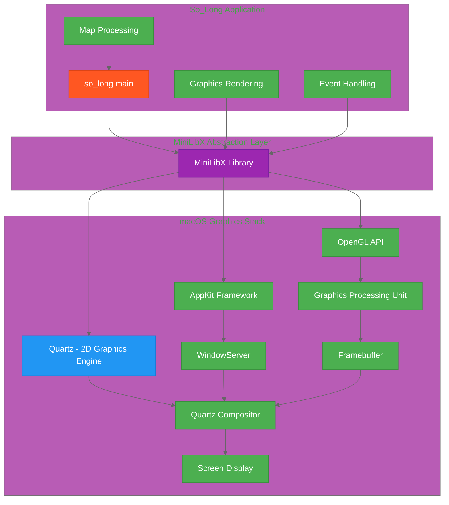

## 2. Complete Program Flow Architecture

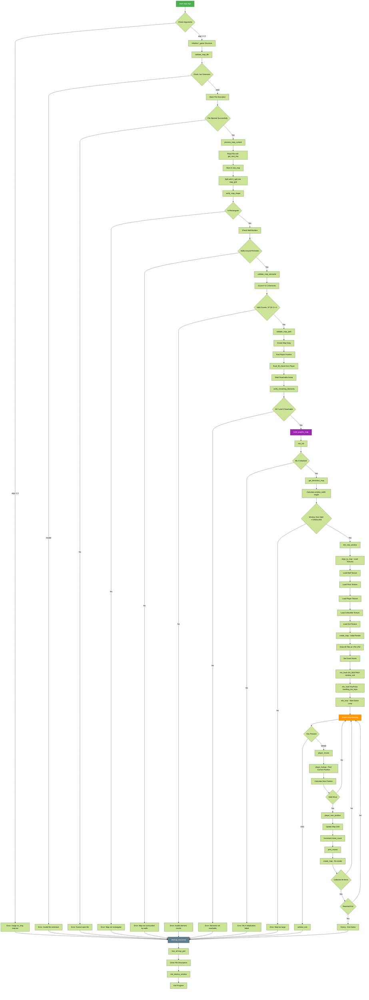

## 3. Data Structure Relationships

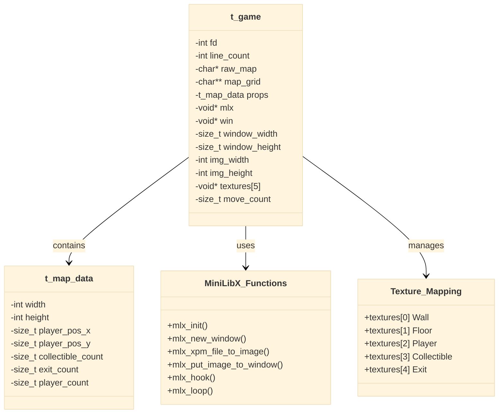

## 4. File Processing Pipeline

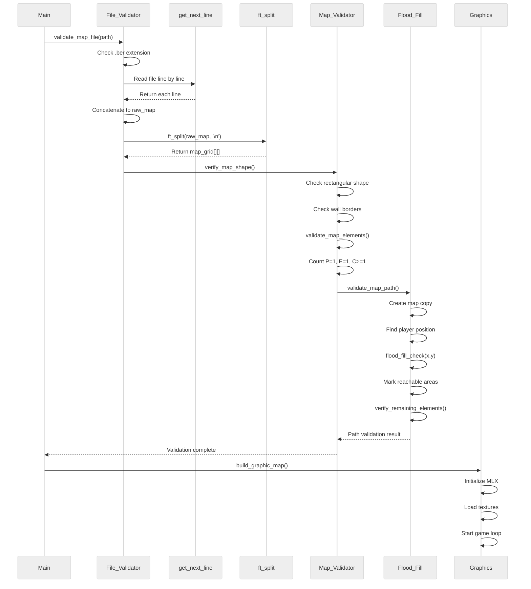

## 5. Event Handling System

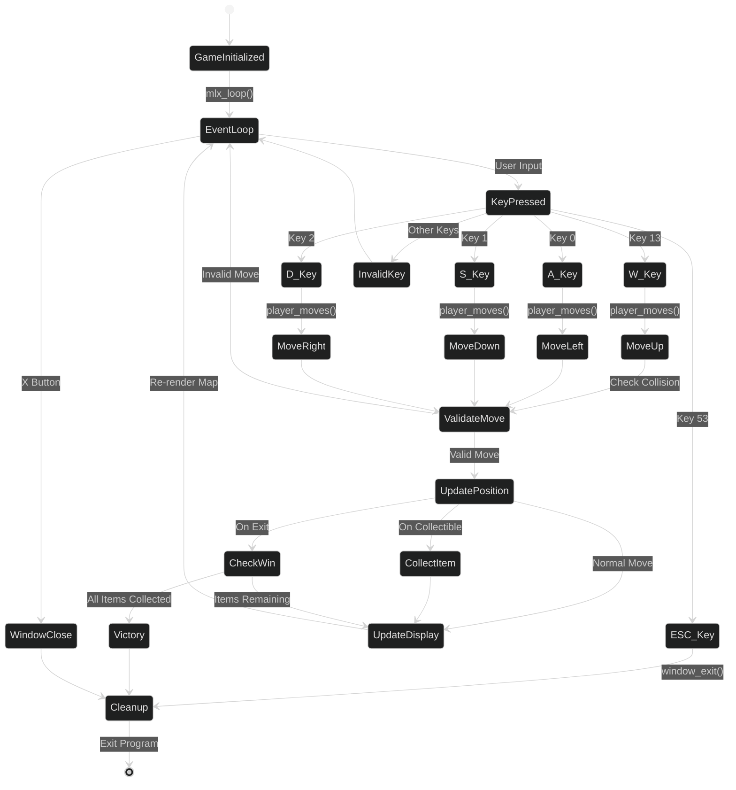

## 6. Memory Management Flow

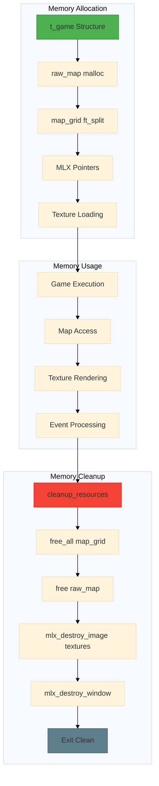

## 7. Error Handling Matrix

```mermaid
%%{init: {'theme': 'base'}}%%
flowchart TD
    subgraph "Input Validation Errors"
        E1[Invalid Arguments] --> ERR[Error Handler]
        E2[Wrong File Extension] --> ERR
        E3[File Not Found] --> ERR
    end
    
    subgraph "Map Validation Errors"  
        E4[Non-rectangular Map] --> ERR
        E5[Missing Wall Border] --> ERR
        E6[Invalid Element Count] --> ERR
        E7[Unreachable Elements] --> ERR
        E8[Map Too Large] --> ERR
    end
    
    subgraph "System Errors"
        E9[MLX Init Failed] --> ERR
        E10[Window Creation Failed] --> ERR
        E11[Texture Load Failed] --> ERR
        E12[Memory Allocation Failed] --> ERR
    end
    
    ERR --> CLEAN[cleanup_resources]
    CLEAN --> FREE[Free All Memory]
    FREE --> EXIT[Exit with Error Code]
    
    style ERR fill:#F44336,stroke:#D32F2F
    style CLEAN fill:#607D8B,stroke:#455A64
    style EXIT fill:#424242,stroke:#212121
```

## Key Constants and Definitions

```c
#define BUFFER_SIZE 10        // get_next_line buffer
#define ESC_KEY 53           // Escape key code
#define W_KEY 13             // W key movement
#define S_KEY 1              // S key movement  
#define A_KEY 0              // A key movement
#define D_KEY 2              // D key movement
#define ON_DESTROY 17        // Window destroy event
#define TILE_SIZE 50         // Each tile is 50x50 pixels
```

## Project Structure Overview

```
so_long/
├── Makefile                 # Build system
├── so_long.h               # Header with all definitions
├── so_long.c               # Main program entry
├── process_map_file.c      # Map validation logic
├── draw_map.c              # Graphics and rendering
├── events.c                # Input handling
├── ft_flood_fill.c         # Path validation algorithm
├── get_next_line.c         # File reading utility
├── ft_split.c              # String manipulation
├── textures/               # XPM image files
│   ├── wall.xpm
│   ├── floor.xpm  
│   ├── player.xpm
│   ├── collectible.xpm
│   └── exit.xpm
└── maps/                   # Test map files
    └── *.ber
```

----------


