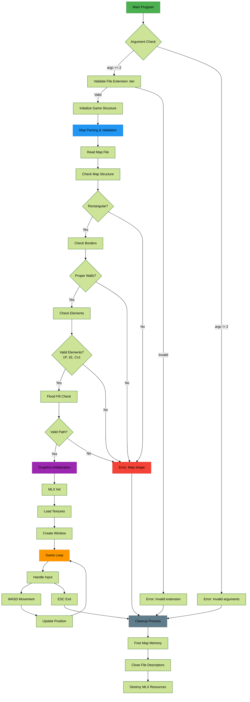
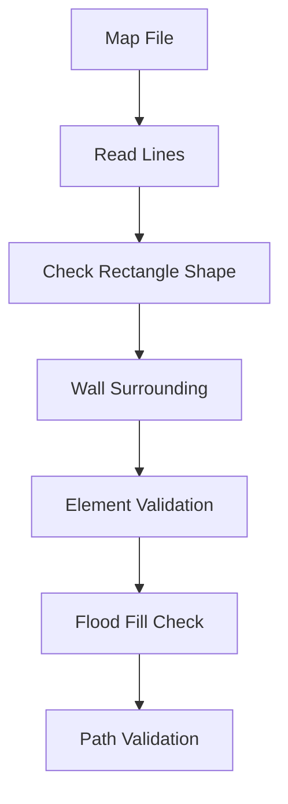
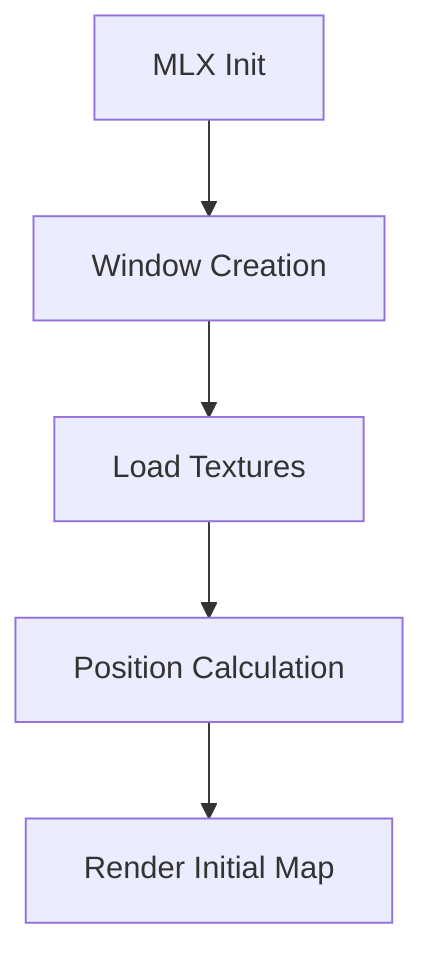
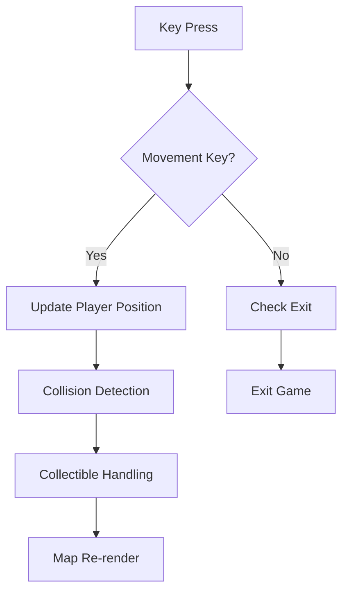
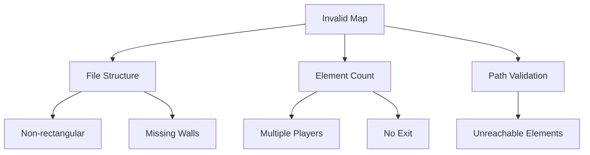

# So_Long Minimalist 2D Pixel Art Gameplay

Experience the retro charm of So_Long – a minimalist 2D pixel art game built using MiniLibX as part of the 42 curriculum. Navigate creative maps, collect items, and reach the exit in this retro-inspired adventure!

## Gameplay Video
## About So_Long

So_Long is a minimalist 2D pixel art game developed to meet the requirements of the 42 curriculum. In the game, the player navigates through uniquely designed maps, collects in-game items, and finds the exit to win the game.

### Features

- **Minimalist Pixel Art:** Simple yet vibrant design that evokes retro gaming nostalgia.
- **Smooth Gameplay:** Intuitive movement and collision detection.
- **Creative Levels:** Unique map layouts that challenge the player.
- **42 Standards:** Developed following the guidelines and style of the 42 school projects.

[Watch the video on Vimeo](https://player.vimeo.com/video/1065327226))

Key Components Explained:

1. **Map Validation Flow**

2. **Graphics Initialization**

3. **Game Loop Mechanics**

4. **Error Handling Cases**

